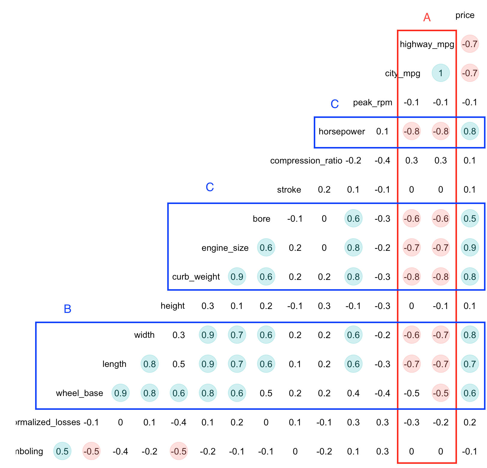

```{r setup, include=FALSE}
knitr::opts_chunk$set(echo = TRUE)
```


```{r eruptions, echo=FALSE, message=FALSE, warning=FALSE}
source("03-environment.R",   encoding = 'UTF-8')
```

El objetivo de este documento es combinar las herramientas vistas en clase para facilitar la limpieza de los datos y el análisis exploratorio. La base de datos proviene de una empresa de seguros y contiene automóbiles y sus características. El objetivo del exámen parcial es lograr seleccionar las variables adecuadas para la etapa de modelaje en la que se pretende predecir el precio del auto.


# Limpieza

Lo primero que se realiza es la limpieza de datos.

## Diagnóstico

```{r echo=F}
library(kableExtra)
kbl(cbind(rawdata, rawdata))  %>%
  kable_paper() %>%
  scroll_box(width = "100%", height = "200px")
```

Podemos notar que: A) hay un problema de datos invadiendo columnas (filas traslapadas) por lo que desplazan los valores, en particular algunos de los valores de la columna *curb_weight* están "pegados" con valores de la columna siguiente; B) que existen errores de registro en la columna *curb_weight* y en la columna *wheel_base*; C) finalmente, que están coexistiendo dos sistemas de *missing values*, aquél original de los datos (señalado con "?") y aquel que R impone sobre los datos ("NA").


## Filas traslpadas

Para corregir este problema, obtamos por el método visto en clase en el que extraemos primero las filas problemáticas, luego separamos las columnas problemáticas con expresiones regulares y, finalmente, imputamos las filas ya corregidas en la base de datos original.


```{r echo=TRUE, eval=FALSE}

problematic_rows <- readr::problems(parcial_data)$row

parcial_data[problematic_rows,] <- parcial_data %>% 
  slice(problematic_rows) %>% 
  unite(col="all", -seq(1:13), sep = "/", remove=TRUE) %>% 
  extract(all, into=c("curb_weight", "engine_type", "resto"), regex="([0-9]{4})([a-z]+)/(.*)/NA", remove=TRUE) %>% 
  separate(resto, into=names(parcial_data)[16:26], sep="/", remove=TRUE) %>% 
  readr::type_convert() %>%
  mutate(across(c("wheel_base",
                  "price",
                  "peak_rpm",
                  "horsepower",
                  "engine_size",
                  "curb_weight"),
                as.character))
```


## Errores puntuales.

Si regresamos a la tabla original, notamos que la variable *wheel-base* cuenta con un valor caracter en lugar de numérico en la fila 157. Para ello optamos por sustituirlo directamente. De manera similar, además de lo que acabamos de corregir, *curb_weight* cuenta con algunas filas con dos ceros adicionales al valor real, para solucionar esto simplemente le damos un formato definido en el que la columna solo acepta valores númericos de no más de 4 caractéres (los primeros).

```{r echo=TRUE, eval=FALSE}
parcial_data$'wheel_base'[157]=95.7
parcial_data$'curb_weight' <- substr(parcial_data$'curb_weight', 0, 4)
```

## Missing values

Finalmente, optamos por cambiar los *missing values* originales por NAs, con el fin de que no transformen las columnas donde están a columnas de caracteres.

```{r echo=TRUE, eval=FALSE}

parcial_data[parcial_data == "?"] <- NA

```

Posteriormente, realizamos una gráfica para visualizar la ocurrencia de missing values. Lo que podemos notar es que 159 filas no presentan ningún missing value; sin embargo 46 filas presentan al menos uno y tan solo dos filas tienen más de 2 missing vallues.

Además notamos la variable que presentan el mayor número de missing values es *normalized_losses* con 41. Fuera de esa columna, los missing values no suponen riesgo mayor para el análisis exploratorio.

```{r, message=FALSE, warning=FALSE, echo= F, out.width="100%"}
library(mice)
md.pattern(parcial_data, rotate.names = T)
```

## Imputación

Podríamos optar por imputar los *missing values* pero para eso tendríamos que evaluar la pertinencia y el posible sesgo.
Por ejemplo, para *price* por lo pronto, antes de adelantarnos al modelo, podríamos hacer una regresión con base en la variable más correlacionada. En cuanto a *stroke, horsepower, peak_rpm* y *num_of_doors*, como contamos con la marca del coche, podríamos ver si los autos de la misma marca comparten estas características y en caso de ser cierto, podríamos hacer una imputación por valor central. Finalmente, el caso más complicado es el de *normalized_losses* donde faltan muchos valores. Considero que en este caso podriamos realizar una imputación con base en k-means. Sin embargo, debido a las restricciones de tiempo, no se realizo imputación alguna.

## Datos finales

Finalmente, le asignamos la clase adecuada a cada columna.

```{r, message=FALSE}

parcial_data<- readr::type_convert(parcial_data)
```

Los datos después de la limpieza lucen de la siguiente manera:

```{r echo=F}
kbl(cbind(parcial_data, parcial_data))  %>%
  kable_paper() %>%
  scroll_box(width = "100%", height = "200px")
```


# EDA

Ahora realizaremos el análisis exploratorio.

## General

```{r warning=F, echo= F, message=F}
ggcorr(parcial_data, geom = "blank", label = TRUE, hjust = 0.75) +
  geom_point(size = 10, aes(color = coefficient > 0, alpha = abs(coefficient) > 0.5)) +
  scale_alpha_manual(values = c("TRUE" = 0.25, "FALSE" = 0)) +
  guides(color = FALSE, alpha = FALSE)
```

Para echar un vistazo general, corremos un correlograma acotado a solo con aquellas variables continuas más correlacionadas. De este análisis general podemos notar que sí hay variables correlacionadas con el precio, muchas de las cuales están correlacionadas entre sí; y que hay más variables con correlación positiva. Solamente *highway_mpg* y *city_mpg* presentan correlaciones negativas de manera significante. 

Habiendo hecho una revisión preliminar, centraremos nuestra atención en las variables que están correlacionadas de manera *wheel_base, length, width, curb_weight, engine_size, bore, horpower,highway_mpg* y *city_mpg*.


## Univariado


```{r echo=FALSE, message=FALSE, warning=FALSE}
mydata <- parcial_data

shinyApp(

 ui <- tabPanel("Univariado",fluidPage(titlePanel("Univariado"),
                                             sidebarLayout(
                                                 sidebarPanel(
                                                     uiOutput(outputId = "aa")
                                                 ),
                                                 mainPanel(textOutput("a"),
                                                           verbatimTextOutput("summary"),
                                                           plotOutput("plot", click = "plot_click")
                                                 )
                                             )
                  )),


server <- function(input,output) {
    
    output$aa <- renderUI({
        selectInput(inputId = "aa2", 
                    label="Selecciona una variable para analizar:",
                    choices = colnames(mydata))
    })
    
    
    mysubsetdata <- eventReactive(input$aa2,{
        mydata[[input$aa2]]
    })
    
    output$summary <- renderPrint({
        summary(mysubsetdata())
    })
    
    output$plot <- renderPlot({
        general(mydata,mysubsetdata())
    })
}, options = list(height = 650))
```

Del análisis univariado podemos concluir que todas las variables con un coeficiente de correlación positivo mayor a.5 (*wheel_base, length, width, curb_weight, engine_size, bore, horpower*) tienen un adistribución mas o menos normal pero sesgada a la izquierda. Solamente *lenght* en menor medida *width* tienen una distribución medianamente simétrica. Esto es interesante porque puede que las variables que tienen que ver con potencia esten siguiendo un patrón común.


## Bivariado

Ahora procedemos a hacer un análisis bivariado. De este análisis concluimos que las variables que están correlacionadas positivamente con el ingreso en realidad las podemos clasificar en dos tipos, de acuerdo a su relación entre ellas: uno grupo de variables relacionadas con la potencia del vehículo y otro relacionado con las dimensiones. Si bien, estos grupos también están muy relacionados entre sí podemos distringuirlos por la poca correlación (relativamente) que puede llegar a haber entre sus miembros, por ejemplo, entre *wheel_base* y *horsepower*.

Asimismo otro grupo, mucho más obvio de encontrar, son las variables *mpg* para carretera y para ciudad que presentan una correlación casi perfecta.


De esta manera definimos los grupos:

Potencia = {*wheel_base, length, width, curb_weight*}

Dimensiones = {*engine_size, bore, horpower,highway_mpg*}

Eficiencia = {*highway_mpg, city_mpg*}

En cuanto a las variables categóricas, se descubrio que las variables categóricas que pueden ser explicativas en realidad están muy relacionadas con los grupos anteriores: por ejemplo, *engine_location*, *engine_type*, *engine_location* y *cylinder* con Potencia; y *body_style* y *drive wheels*  con Dimensiones.

Llama la atención que las variables creadas por los actuarios en la base de datos no están tan correlacionadas con el precio como otras.


```{r echo=FALSE, message=FALSE, warning=FALSE}
shinyApp(

 ui <- tabPanel("Bivariado",fluidPage(titlePanel("Bivariado"),
                                                   sidebarLayout(
                                                       sidebarPanel(
                                                           uiOutput(outputId = "bb"),
                                                           uiOutput(outputId = "cc"),
                                                           multiple = 
                                                               TRUE),
                           
                                                       mainPanel(textOutput("b"),
                                                                 verbatimTextOutput("summary2"),
                                                                 verbatimTextOutput("summary3"),
                                                                 plotOutput("plot2", click = "plot_click")
                                                       )
                                                   )
                  )),


server <- function(input,output) {
    
     output$bb <- renderUI({
        selectInput(inputId = "bb2", 
                    label="Selecciona una variable para analizar",
                    choices = colnames(mydata))
    })
    
    
    mysubsetdata2 <- eventReactive(input$bb2,{
        mydata[[input$bb2]]
    })
    
    output$cc <- renderUI({
        selectInput(inputId = "cc2", 
                    label="Seleccciona otra variable para analizar",
                    choices = colnames(mydata))
    })
    
    mysubsetdata3 <- eventReactive(input$cc2,{
        mydata[[input$cc2]]
    })  
    output$summary2 <- renderPrint({
        summary(mysubsetdata2())
    })
    
    output$summary3 <- renderPrint({
        summary(mysubsetdata3())
    })
    
    output$plot2 <- renderPlot({
        bigeneral(mydata,input$bb2,input$cc2)
    })
    
}, options = list(height = 650))

```

## Multivariado

En esta parte aprovechamos para graficar tres dimensiones y ver si las variables categóricas nos podrían ayudar como criterio de desempate para predecir precios, cuando el potencial predictivo de las variables continuas se ha agotado.

En este sentido,  estas variables nos permiten diferenciar de mayor manera entre grupos que un análisis bidimensional. En consecuencia, se consideró que *drive wheels*, *engine_type* y *num_of_cylinders* tienen un alto potencial predictivo cuando van acompañados de otras variables.


```{r echo=FALSE, message=FALSE, warning=FALSE}
shinyApp(

 ui <- tabPanel("Multivariado",fluidPage(titlePanel("Multivariado"),
                                                   sidebarLayout(
                                                       sidebarPanel(
                                                           uiOutput(outputId = "dd"),
                                                           uiOutput(outputId = "ee"),
                                                           uiOutput(outputId = "ff"),
                                                           multiple = 
                                                               TRUE),
                                                       
                                                       mainPanel(textOutput("c"),
                                                                 verbatimTextOutput("summary4"),
                                                                 verbatimTextOutput("summary5"),
                                                                 verbatimTextOutput("summary6"),
                                                                 plotOutput("plot3", click = "plot_click")
                                                       )
                                                   ))),


server <- function(input,output) {
    
      output$dd <- renderUI({
        selectInput(inputId = "dd2", 
                    label="Select una parametro de color (b)",
                    choices = colnames(mydata %>% select_if(is.character)))
    })
    
    
    mysubsetdata4 <- eventReactive(input$dd2,{
        mydata[[input$dd2]]
    })
    
    output$ee <- renderUI({
        selectInput(inputId = "ee2", 
                    label="Seleccciona una variable para analizar",
                    choices = colnames(mydata))
    })
    
    mysubsetdata5 <- eventReactive(input$ee2,{
        mydata[[input$ee2]]
    })  
    
    output$ff <- renderUI({
        selectInput(inputId = "ff2", 
                    label="Seleccciona otra variable para analizar",
                    choices = colnames(mydata))
    })
    
    mysubsetdata6 <- eventReactive(input$ff2,{
        mydata[[input$ff2]]
    })  
    
    output$summary4 <- renderPrint({
        summary(mysubsetdata4())
    })
    
    output$summary5 <- renderPrint({
        summary(mysubsetdata5())
    })
    
    output$summary6 <- renderPrint({
        summary(mysubsetdata6())
    })
    
    output$plot3 <- renderPlot({
        multigeneral(mydata,mysubsetdata4(),input$ee2,input$ff2)
    })
    
},options = list(height = 650))

```

# Conclusión

Del análisis exploratorio se concluye que podemos categorizar a las variables en tres grupos: el grupo A (Eficiencia) con un claro efecto negativo en el precio y los grupos B (Dimensiones) y C (Potencia) con un efecto positivo. La distinción entre ambos está en que, en primer lugar, el impacto positivo en el precio es mayor en el grupo C; en segundo lugar, en que a pesar de que ambos grupos estén muy correlacionados, el grupo C presenta una relación muy clara los caballos de fuerza; finalmente, en que el grupo A y el C presentan una correlación negativa más marcada.

Asimismo, podríamos considerar un cuarto grupo de variables categóricas para "desempatar" cuando las variables continuas ya no puedan diferenciar entre casos particulares. Dichas variables son *drive wheels*, *engine_type* y *num_of_cylinders*.

En este sentido, se concluye que las variables de estos tres grupos son las que tienen el mayor potencial predictivo. Sin embargo, debido a la correlación entre ellas, considero que cualquier modelo que contemple al menos *horsepower^* para medir potenica, *wheel_base* para medir dimensiones y *highway_mpg* para medir eficiencia estaría más que completo. Asimismo, se podría potencializar el modelo si usamos alguna (o las tres) de las tres variables categóricas.

```{r, message=FALSE, warning=FALSE, echo= F,out.width="1000%"}

```
